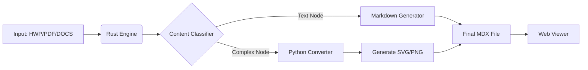

# MDM: The Future of Multimedia Storytelling in Markdown


MDM (Markdown+Media) is a superset of Markdown designed to seamlessly embed and control local multimedia content like images, videos, and audio with an intuitive syntax. It aims to solve the problem of broken media links and the lack of rich media control in standard Markdown, making it perfect for personal knowledge management (PKM), technical documentation, and digital content creation.

**Note:** This project is in the specification and initial development phase. The NPM/PyPI/Crates badges are placeholders for our future releases.

---

## 🤔 The Problem

Standard Markdown is great for text, but it falls short with local media:

- **Fragile Paths:** Moving your `.md` files often breaks image links (`../images/pic.png`).
- **No Control:** You can't specify a video's width, make it autoplay, or loop it without resorting to raw HTML.
- **Limited Media Types:** Embedding audio files or creating image galleries is cumbersome and non-standard.

### Korean Government Digital Transformation Challenge

대한민국 정부의 **'디지털 플랫폼 정부'** 기조와 **'기계 판독 가능한 데이터(Machine Readable Data)'** 정책에 발맞추어, 기존의 `HWP`, `HWPX`, `PDF`, `DOCX` 등 비정형 공문서를 **데이터(Text)**와 **시각 정보(Media)**로 지능적으로 분리하여 변환합니다.

---

## 💡 The Solution: `![[]]` Syntax for Advanced Images

MDM introduces a single, powerful syntax: `![[]]`. For our MVP, we are focusing on creating a best-in-class experience for image handling.

### 🖼️ Advanced Image Control

Go beyond simple image display. Create centered, captioned, or precisely-sized images with ease.

```markdown
// Simple image embed
![[profile.jpg]]

// Image with attributes (alignment, width, alt text, caption)
![[brand-logo.png | width=250px align=center alt="MDM Project Logo" caption="The official MDM logo"]]
```

### ✨ Image Presets (Size & Ratio)

To make responsive design intuitive, MDM includes built-in presets for common sizes and aspect ratios.

```markdown
// Use a preset for a thumbnail
![[photo.jpg | size=thumb]]

// Use a preset for a widescreen 16:9 ratio
![[landscape.jpg | ratio=widescreen]]
```

| Category  | Preset Name                                             | Representative Value                        |
| :-------- | :------------------------------------------------------ | :------------------------------------------ |
| **Size**  | `thumb`, `small`, `medium`, `large`                     | `150px`, `480px`, `768px`, `1024px` (width) |
| **Ratio** | `square`, `standard`, `widescreen`, `portrait`, `story` | `1:1`, `4:3`, `16:9`, `3:4`, `9:16`         |

### 📁 Supported Image Formats

Our goal is to support a wide range of image formats. The MVP will prioritize:

- **Standard:** `jpg`, `jpeg`, `png`, `gif`
- **Modern:** `webp`, `svg`

---

## 🚀 Core Philosophy

**"읽을 것은 읽고, 볼 것은 본다"**

1. **Text Stream (Data)**: 본문, 개조식 문장 등 텍스트 데이터는 순수 **Markdown**으로 추출하여 AI 학습 및 검색 엔진 최적화(SEO)를 지원합니다.
2. **Media Stream (Visual)**: 마크다운으로 표현하기 힘든 복잡한 표(Complex Tables), 차트, 다단 레이아웃은 **SVG/PNG**로 캡처하여 원본의 가독성을 보존합니다.
3. **Unified Viewer**: `.mdx` 파일을 별도의 설치 없이 브라우저에서 즉시 열람할 수 있는 경량 뷰어를 제공합니다.

---

## 🛠 Tech Stack

| Component       | Language      | Role            | Description                                                                  |
| --------------- | ------------- | --------------- | ---------------------------------------------------------------------------- |
| **Core Engine** | **Rust** 🦀   | Parsing & Speed | C언어에 준하는 속도로 HWP(OLE), PDF 바이너리를 고속 분석합니다.              |
| **Converter**   | **Python** 🐍 | Bridge & OCR    | 방대한 라이브러리를 활용하여 차트/표를 이미지로 변환하거나 OCR을 수행합니다. |
| **Viewer**      | **JS/TS** ⚡  | Rendering       | 변환된 MDX 파일을 웹 환경에서 완벽하게 시각화하는 단일 HTML 뷰어입니다.      |

---

## 🏗 Architecture



---

## 📦 Installation

```bash
npm install markdown-media
```

---

## 🗓 MVP Roadmap: JavaScript First

Our immediate goal is to deliver a stable JavaScript parser as the foundation of the MDM ecosystem. Future phases will include Python and Rust implementations.

### Phase 1: Foundation ✅ COMPLETE

- [x] 프로젝트 아키텍처 수립
- [x] JavaScript Parser 구현 (Tokenizer, Parser, Renderer)
- [x] Rust 기반 HWP 바이너리 파싱 프로토타입 (OLE structure analysis)
- [x] Python 기반 표(Table) → SVG 렌더링 스크립트 작성
- [x] 프리셋 시스템 구현 (size, ratio presets)

### Phase 2: Core Implementation ✅ COMPLETE

- [x] HWP/PDF → MDX 변환기 구현 (기본 구조)
- [x] CLI 도구 구현 (convert, validate, serve commands)
- [x] CI/CD 설정 (GitHub Actions)

### Phase 3: Deployment 🚧 IN PROGRESS

- [x] Single HTML Viewer 개발
- [ ] npm 패키지 배포 (@mdm/parser, @mdm/cli)
- [ ] PyPI 패키지 배포
- [ ] 완전한 HWP 바이너리 파싱 (format spec 기반)

---

## 📁 Project Structure

```
markdown-media/
├── README.md              # 프로젝트 소개
├── package.json           # npm 패키지 설정
├── index.js               # 메인 엔트리포인트
├── core/                  # [Rust] 고속 파서 엔진
│   ├── Cargo.toml
│   └── src/
├── converters/            # [Python] 이미지 변환 및 OCR 브릿지
│   ├── hwp_to_svg.py
│   └── pdf_processor.py
├── viewer/                # [JS/HTML] 결과물 확인용 뷰어
│   ├── index.html
│   └── style.css
└── samples/               # 테스트용 데이터
    ├── input/             # 공공데이터 (hwp, pdf)
    └── output/            # 변환 결과 (mdx, svg, png)
```

---

## 🔧 Markdown-Media Bundle Format

변환된 결과물은 다음과 같은 번들 구조를 따릅니다:

```
/2024_보고서 (Markdown-Media Bundle)
├── index.md         # (Data) 텍스트 본문 (순수 데이터)
├── media/           # (Visual) 추출된 SVG 표, PNG 차트, 동영상
│   ├── table_01.svg
│   └── chart_02.png
└── meta.json        # (Context) 원본 문서 메타데이터
```

---

## 🤝 How to Contribute

MDM is an open-source project, and we welcome contributions of all kinds! Please see our `plan.md` for the detailed roadmap and `CONTRIBUTING.md` for guidelines on how to get involved.

공공 데이터 혁신에 관심 있는 개발자분들의 참여를 환영합니다.

---

## 📦 Deployment

### npm Packages

```bash
# Login to npm
npm login  # Use beasthan2025 account

# Run deployment script
./scripts/deploy.sh
```

### Python Package

```bash
# Deploy to PyPI
./scripts/deploy-pypi.sh
```

### Manual Deployment

See [docs/USER_GUIDE.md](docs/USER_GUIDE.md) for detailed deployment instructions.

---

## ❓ FAQ

### What file formats are supported?

MDM converts the following formats to **Markdown+Media bundles**:

✅ **HWP** (Hancom Office) - Korean government documents
✅ **PDF** - Portable Document Format  
✅ **HTML** - Web pages and blog posts (Naver, Tistory, WordPress)
🔜 **DOCX** - Microsoft Word (planned)

### Is this an HTML-to-Markdown converter?

**Partially yes!** MDM now supports:

**HTML → MDM**: Convert HTML files (especially blog posts) to Markdown+Media bundles

```bash
mdm convert blog.html -o output/
python converters/html_converter.py --url https://blog.naver.com/post/123 output/
```

**Supported blog platforms:**

- Naver Blog (blog.naver.com)
- Tistory
- WordPress
- Generic HTML

**What it does:**

```
HTML/HWP/PDF → Clean Markdown (.mdx) + Media Assets (SVG/PNG)
```

### Use Cases

1. **Blog Archive**: Save Naver/Tistory posts as Markdown
2. **Government Documents**: Convert HWP files to web format
3. **PDF Reports**: Extract text and images from PDFs
4. **Personal Knowledge**: Import blogs into Obsidian/Logseq

### What's the output format?

A **Markdown-Media Bundle**:

```
output/
├── index.mdx        # Pure Markdown text
├── index.mdm        # Resource metadata (JSON)
└── assets/
    ├── table_1.svg  # Tables as SVG
    ├── image_1.png  # Downloaded images
    └── image_2.jpg
```

---

## 📜 License

The MDM specification and documentation are licensed under Creative Commons BY-SA 4.0.
All source code is licensed under the MIT License.

---

**Author**: seunghan91 (npm: beasthan2025)
**Last Updated**: 2025.12.17
